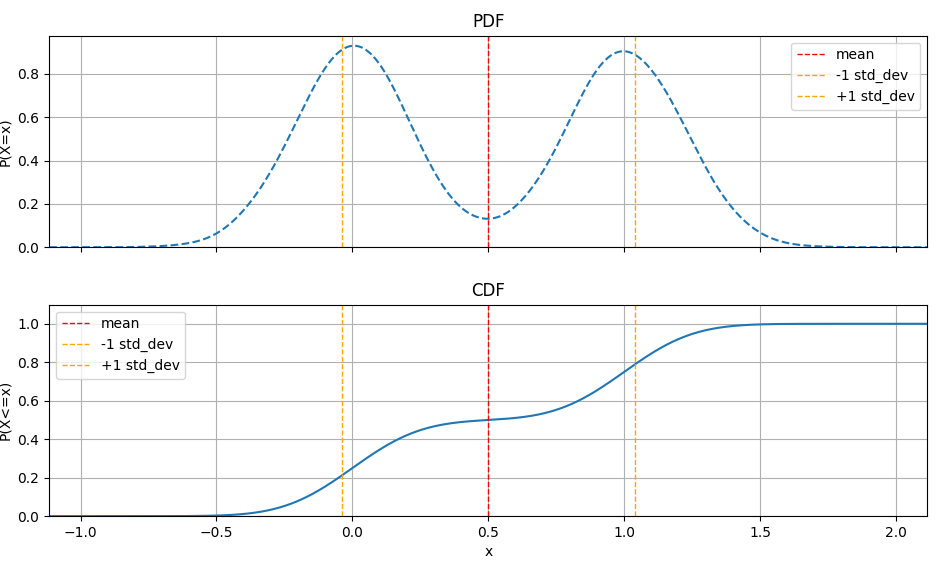

# RandCraft

RandCraft is a Python library for object-oriented combination and manipulation of univariate random variables, built on top of the [scipy.stats](https://docs.scipy.org/doc/scipy/reference/stats.html) module.


## Usage Example
Have you ever wanted to add together random variables but can't be bothered working out an analytical solution?
Randcraft makes it simple.

```python
from randcraft import make_normal, make_coin_flip

coin_flip = make_coin_flip()
# <RandomVariable(discrete): mean=0.5, var=0.25>
norm = make_normal(mean=0, std_dev=0.2)
# <RandomVariable(normal): mean=0.0, var=0.04>
combined = coin_flip + norm 
# <RandomVariable(mixture): mean=0.5, var=0.29>
combined.sample_one()
# 0.8678903828104276
combined.pdf.plot()
```



## Features

- **Object-oriented random variables:** Wrap and combine distributions as Python objects.
- **Distribution composition:** Add, multiply, and transform random variables.
- **Sampling and statistics:** Easily sample from composed distributions and compute statistics.
- **Extensible:** Supports custom distributions via subclassing.
- **Integration with scipy.stats:** Leverages the full power of scipy's probability distributions.

## Supported Distributions

RandCraft currently supports the following distributions:

- Normal
- Uniform
- Beta
- Anon: Anonymous distribution function based on a provided sampler function
- Discrete
- DiracDelta
- ...more coming soon!

Distributions can all be combined arbitrarily with addition and subtraction.
The library will simplify the new distribution analytically where possible, and use numerical approaches otherwise.

Mixture distributions are also supported.

You can also extend RandCraft with your own custom distributions.

## Installation

```bash
pip install randcraft
```

## API Overview

- `make_normal`, `make_uniform` ...etc: Create a random variable.
- Arithmetic operation on individual RVs with constants: `+`, `-`, `*`, `/`, `**`
- Arithmetic operations: `+`, `-` between RVs.
- `.sample_numpy(size)`: Draw samples.
- `.get_mean()`, `.get_variance()`: Get statistics.
- `.get_chance_that_rv_is_le(x)`: Evaluate cdf at point
- `.get_value_that_is_at_le_chance(x)`: Evaluate inverse cdf at point

## Extending RandCraft

You can create custom random variable classes by subclassing the base RV class and implementing required methods.

## Known limitations

The library is designed to work with univariate random variabels only. Multi-dimensional rvs or correlations etc are not supported.

## License

MIT License

## Acknowledgements

Built on [scipy.stats](https://docs.scipy.org/doc/scipy/reference/stats.html).